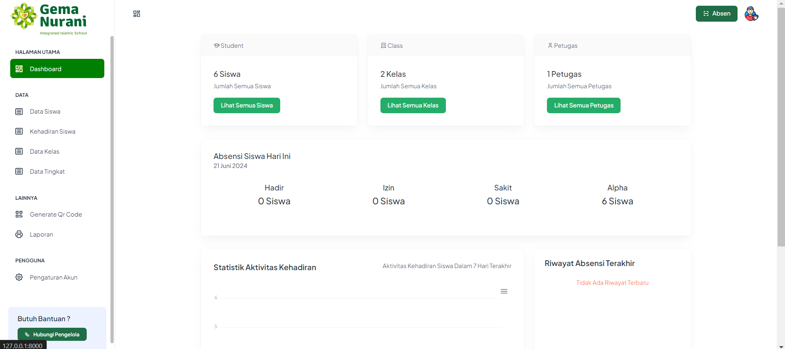

<h1>Absensi Qr Code Berbasis Web Menggunakan Laravel Di SMPIT Gema Nurani</h1>

V.1.01  |  Project Senpro SMPIT Gema Nurani

- Preview Dashboard -

<h2>Cara Instalasi :</h2>
<ul>
    <li> > git clone https://github.com/farsyafad12/absensi-gn</li>
    <li> > cd absensi-gn</li>
    <li> <b>Note : Pastikan Sudah Menghapus ; pada extension=gd Dan extension=zip Pada File php.ini</b></li>
    <li> > composer install or composer update</li>
    <li> > cp .env.example .env Atau copy .env.example .env</li>
    <li> > Set up .env file</li>
    <li> > php artisan key:generate</li>
    <li> > php artisan storage:link</li>
    <li> Note : Sebelum Melanjutkan, Pastikan Sudah Membuat Database MySQL <b>"absensi_gn"</b></li>
    <li> > php artisan migrate:fresh --seed</li>
    <li> > php artisan serve</li>
    <li> <a href="http://127.0.0.1:8000/">http://127.0.0.1:8000/</a> </li>
</ul>

<h3>Login Akun Pengelola</h3>

- Username : admin@example.com, Password: admin

Note : Maaf Jika Ada Kekurangan / Kerentanan Pada Project Ini, Dikarenakan Pembuat Masih Belajar, Jika Ingin Membantu Bisa Pull Request yaa...

Terakhir Di Update Pada 4 Maret 2024

<h2>Catatan Versi</h2>
<h6>V.1.01</h6>
<ul>
    <li>Perbaikan Validasi Form</li>
    <li>Menambahkan Halaman Version</li>
    <li>Update UI Icon</li>
    <li>Dashboard Update</li>
    <li>Kehadiran Siswa</li>
    <li>Akses Pengguna</li>
    <li>Merapihkan Tampilan UI</li>
    <li>Menambahkan Halaman Not Found</li>
    <li>Fixed Bug Filter Data Siswa</li>
</ul>
<h6>V.1.0.0</h6>

Rilis Aplikasi Dengan Versi Pertama Dengan Fitur Awal

Selengkapnya Bisa Kunjungi <a href="http://127.0.0.1:8000/version">- http://127.0.0.1:8000/version -</a>

<h3 style="color:red">Catatan</h3>

Hanya Untuk Digunakan Oleh :

<h5>Organisasi SIT Gema Nurani</h5>

All Right Reserved  |  Copyright 2024  |  Powered By Ahnaf Samih

Project Ini Dibuat Hanya Untuk Menyelesaikan Tugas, Bukan Untuk Public, Mohon Kerjasamanya !

